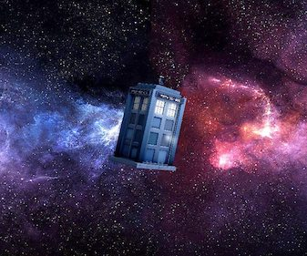

# Elm Time Travel

This assignment provides to you two small video games written in Elm. You will write code that can take any arbitrary Elm game, and add time travel to it.

How is this possible? An Elm application is a collection of several functions that work together to manage the application’s state. One creates the initial state. One updates the state based on user input and/or time passing. One displays the current state on the screen. All these functions have one thing in common: they are pure functions, meaning their only input is their parameters, and their only output is their return value.

Because the app is just a few functions, you can take a _whole application_ as a value and wrap your own behavior around those functions. And because they are _pure_ functions, if you remember all the inputs that came in, you can accurately reproduce the entire state of the application at any point in time by reapplying the functions! Thus time travel consists of three things:

- Remember all the input data that came to the application.
- Implement the ability to recreate past application states using all that saved input data.
- Build a user interface to pause the app, travel back to a past state, and then resume.

Learning goals for this assignment:

- Gain familiarity with purely functional programming in general.
- Gain familiarity with a statically typed functional language in particular.
- Begin to understand the possibilities and limitations this model of programming creates, by doing something nifty that would be very difficult to do in a language with side effects.

## The assignment

- Part 0: [Install tools and get oriented](docs/0-setup.md)
- Part 1: [Make a small change](docs/1-small-change.md)
- Part 2: [Build a time machine](docs/2-time-machine-step-0.md) (in 4 steps)
